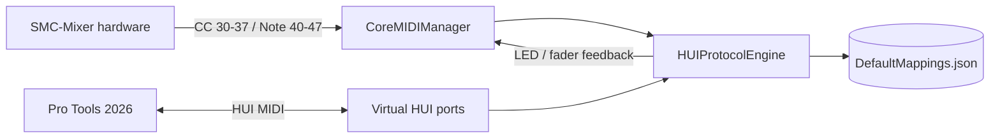

# TURN

[](https://www.apple.com/macos/)
[](https://www.swift.org)
[](LICENSE)
[](https://developer.apple.com/design/human-interface-guidelines/menus-and-shortcuts)

**TURN** is a native macOS menu bar app that bridges the [M-VAVE SMC-Mixer](https://www.m-vave.com/product?id=smc-mixer) wireless MIDI controller to **Avid Pro Tools** through the **HUI protocol** — no drivers, no MIDI routing utilities, no middleware.

Faders, channel buttons and transport controls on the SMC-Mixer drive Pro Tools directly. Pro Tools sends state back, so button LEDs, fader level indicators and meters stay in sync with your session.

> Requires the SMC-Mixer in **CC Mode** with the [`smc-mixer-cc.smc`](smc-mixer-cc.smc) preset loaded (included in this repository).

---

## Features

- **8 faders** mapped to Pro Tools volume (CC 30–37 → HUI fader messages)
- **Channel buttons** (Note 40–47) controlling Mute per channel
- **Reserved mappings** for Solo, Record Arm, Select, Transport and Bank navigation (CC 48–96), ready to assign in M-VAVE MidiSuite
- **Bidirectional feedback**: Pro Tools sends fader positions, switch states (LEDs) and audio meters back to the hardware
- **HUI ping** handled automatically so Pro Tools keeps the controller alive
- **Zero configuration**: virtual MIDI ports (`Avid Virtual HUI In/Out`) are created on launch and auto-connect to any SMC-Mixer source
- **Menu bar native**: SwiftUI `MenuBarExtra`, Settings window with "Open at Login" (`SMAppService`), SF Symbols throughout — built against Apple's Human Interface Guidelines for macOS 27
- **Swift 6 strict concurrency**, `Logger`-based diagnostics, English + Portuguese localization

## How it works



The decoded hardware preset ([`smc-mixer-cc.smc`](smc-mixer-cc.smc)) defines the physical layout:

| Physical control | MIDI message | HUI target |
|---|---|---|
| Faders 1–8 | CC 30–37 | HUI fader 1–8 |
| Channel buttons 1–8 | Note On 40–47 | HUI Mute 1–8 |
| Button LEDs | Note On/Off 0–31 (firmware-fixed) | Mute/Solo/Rec/Select rows |
| Fader LEDs | CC 30–37 (level) | Fader position feedback |

## Requirements

- **macOS 27.0 (Golden Gate)** or later
- **Pro Tools 2026** (any HUI-capable version works)
- M-VAVE **SMC-Mixer** in CC Mode with the included preset
- Xcode 18+ to build from source

## Setup

### 1. Pro Tools

1. Open **Setup → Peripherals**
2. Under **MIDI Controllers**, add a **HUI** unit with **8 channels**
3. Set *Receive From* → `Avid Virtual HUI Out`
4. Set *Send To* → `Avid Virtual HUI In`
5. Enable **Audio → Input Devices** passthrough if prompted

### 2. SMC-Mixer hardware

1. Load `smc-mixer-cc.smc` onto the device with **M-VAVE MidiSuite** (Windows/macOS/iOS)
2. Switch the mixer to **CC Mode**: hold **SHIFT** and press the **>** button — the `>` LED lights up
3. Connect via USB-C or Bluetooth MIDI

### 3. TURN

Launch the app. The menu bar icon reflects connection state:

- `slider.vertical.3` — hardware connected
- `slider.horizontal.3` — hardware not detected

Open the menu to check both statuses (Hardware, Pro Tools HUI). Use **Settings** (⌘,) to enable *Open at Login*.

## Building from source

```bash
git clone https://github.com/sbacaro/TURN.git
cd TURN
open TURN.xcodeproj    # then ⌘R in Xcode
```

Or from the command line:

```bash
xcodebuild -project TURN.xcodeproj -scheme TURN -configuration Release build
```

## Project structure

```
TURN/
├── TURN.xcodeproj/          # Native Xcode project (synchronized groups)
├── TURN/                    # Source (auto-mirrored into the build)
│   ├── TURNApp.swift        # App entry: MenuBarExtra + Settings scene
│   ├── CoreMIDIManager.swift# Core MIDI stack, virtual ports, auto-connect
│   ├── HUIProtocolEngine.swift # MIDI ↔ HUI bidirectional translator
│   ├── PresetManager.swift  # Mapping table loader
│   ├── DefaultMappings.json # Decoded .smc hardware preset
│   └── Assets.xcassets      # App icon (SF Symbol based), AccentColor
├── smc-mixer-cc.smc         # Hardware preset (load via MidiSuite)
└── LICENSE                  # PolyForm Noncommercial 1.0.0
```

## Contributing

Contributions are welcome! Please read [CONTRIBUTING.md](CONTRIBUTING.md) before opening a pull request. Bug reports and feature ideas go through [Issues](https://github.com/sbacaro/TURN/issues).

## License

Copyright (c) 2026 Samuel Bacaro

This project is licensed under the [PolyForm Noncommercial License 1.0.0](LICENSE) — free for personal and non-commercial use. Commercial use requires a separate license from the author.

M-VAVE and SMC-Mixer are trademarks of their respective owners. This project is not affiliated with or endorsed by M-VAVE, Avid, or Apple.
